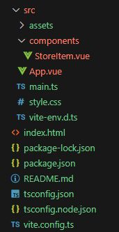
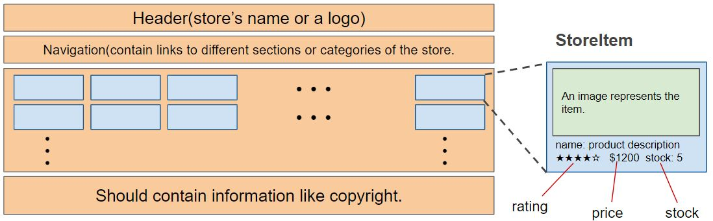

# Assignment 2: Online Store Layout with Vue 3.x and CSS Grid/Flexbox

### Objectives:

- Gain hands-on experience with Vue 3.x's fundamental features.
- Employ CSS Grid layout and CSS Flexbox for design and structuring.
- Understand the core principles of Vue.js 3 component design and structuring.

### Preparation:

- **IDE Setup:** Use [VS Code](https://code.visualstudio.com/) with the [Volar](https://marketplace.visualstudio.com/items?itemName=Vue.volar) extension. Ensure Vetur is disabled. Additionally, install the [TypeScript Vue Plugin (Volar)](https://marketplace.visualstudio.com/items?itemName=Vue.vscode-typescript-vue-plugin).

- **GitHub Setup:** Have a GitHub account and ensure you can access it using SSH Key. If you haven't done so, follow this [tutorial](https://youtu.be/a-zX_qc2S-M).

- After the initial step, accept your instructor's GitHub classroom invitation to initialize a repo under your GitHub account.

- Clone the repo to your local computer:

  ```bash
  git clone [YOUR_REPO_LINK].git
  ```

- Ensure you're working inside the cloned repo.

- **NodeJS:** Must be installed on your computer. Verify with:

  ```bash
  node -v    # v14 or newer
  npm -v     # v8 or newer
  ```

- **Deployment with Vercel:** Have a [Vercel](https://vercel.com/) account or use your GitHub account to log in. Install the Vercel CLI:

  ```bash
  npm install --global vercel
  ```

  Verify and login to Vercel:

  ```bash
  vercel login
  ```

- Install required packages:

  ```bash
  npm install
  ```

- Run a local development server (default port 5173):

  ```bash
  npm run dev
  ```

- Access the project at `localhost:5173`.

### Instructions:

Your project includes the following starter files/directories:



The `style.css` is imported by `main.ts` and will globally style the app. Apply component-specific styles in `App.vue` and `components/StoreItem.vue`.

Initially, it's recommended to only change the `#app` style in `style.css` and then focus on the `<style>` blocks in the `.vue` files.

#### Task Breakdown:

**App.vue (Main Layout)**

- Use CSS Grid to design the store layout: Header, Nav, Main Content, and Footer.

**Header:** Showcase the store's name or logo. Use CSS Flexbox for styling.

**Nav:** Contains navigation links to different sections or categories.

**Main Content:** Display a grid of store items.

- Implement `src/components/StoreItem.vue` using props, reactive references, and data-binding.
- In `App.vue`, use `v-for` to list items with the `StoreItem` component.

**Footer:** Contains attributions, copyrights, or other relevant links.

**StoreItem.vue Component Details:**

Properties:

- `name: string;`
- `description: string;`
- `price: number;`
- `rating: number;`
- `stock: number;`
- `image: string;`
- `category: string;`

**Layout:** The layout should span the browser's width.



### Extra Credit Options:

- (2 pts) Highlight an item on mouse hover.

For other extra credit ideas, consult with your instructor.

### Grading Rubrics:

| Grading Item                                         | Points |
| ---------------------------------------------------- | -----: |
| GitHub setup with SSH Key & cloned repo              |     10 |
| NodeJS and Vercel setup; deployment to Vercel server |     10 |
| `StoreItem.vue` implementation                       |     30 |
| `App.vue` implementation                             |     30 |
| Commit all changes & push to GitHub                  |     10 |
| Deploy the production version to Vercel server       |     10 |

### Deliverables:

Submit your Vercel deployment URL in Blackboard.

**Note:** While functionality is crucial, a well-designed and visually appealing user interface also plays a significant role.

```

I've mainly enhanced clarity, made instructions more direct, improved the Grading Rubrics table, and provided a more consistent Markdown formatting.
```
